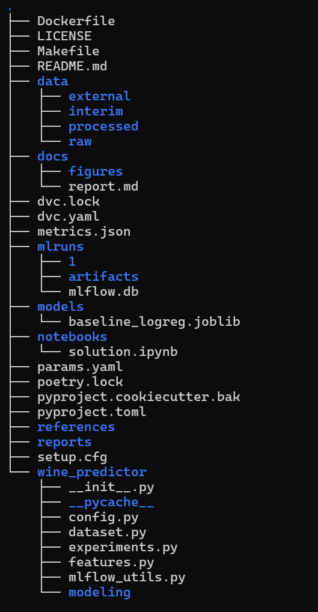
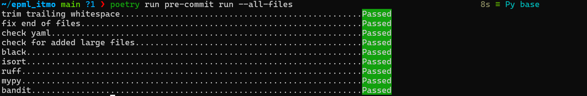
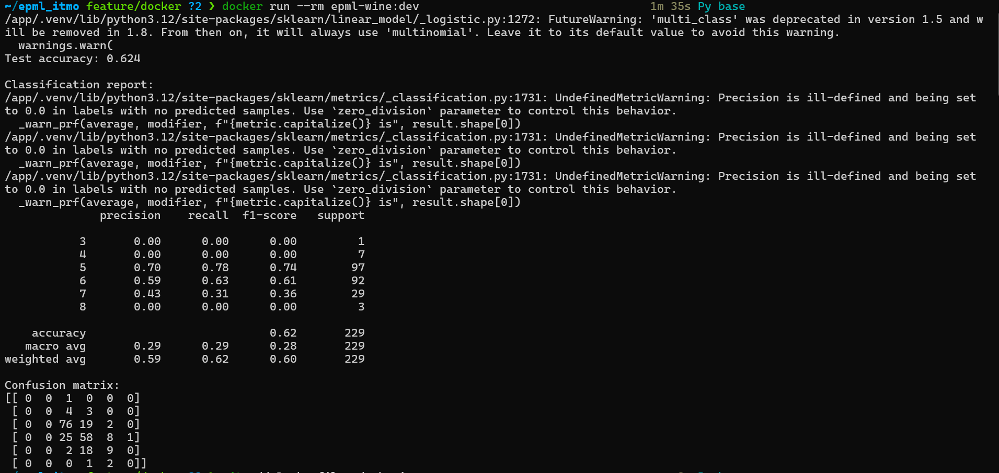
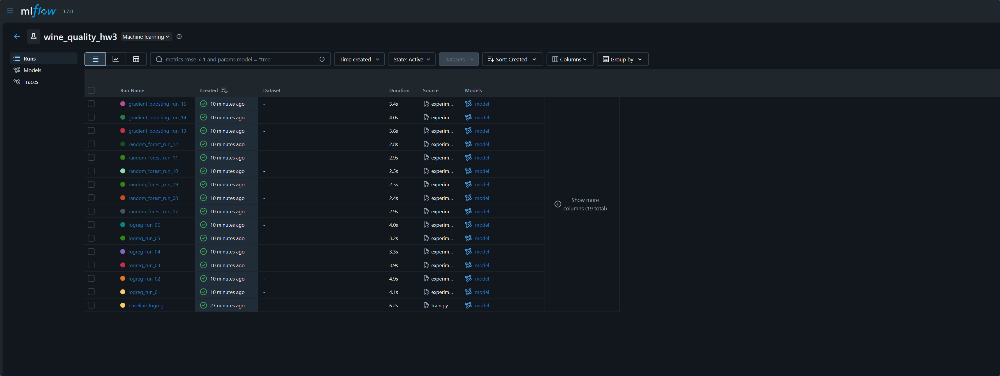
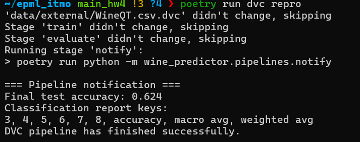
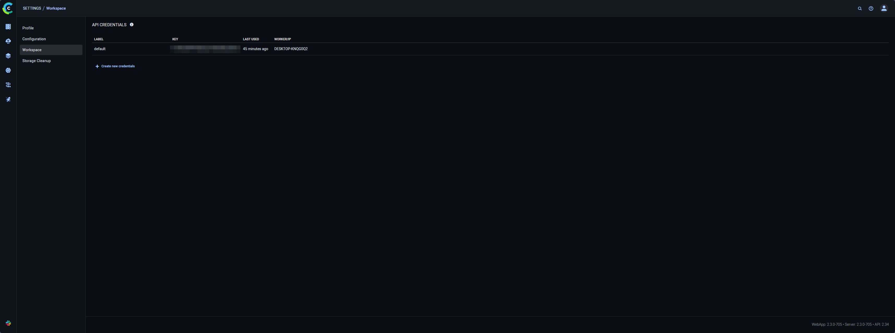
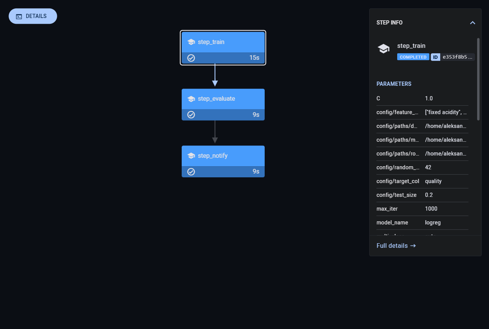

# HW 4

## 1. Overview

The point of HW 5 is setting up ClearML for our existing project.
Also, from previous stages we inherit:

- Cookiecutter for the overall template
- Poetry for dependencies, convenient setup with pyproject
- Pre-commit hooks and linting (Black, isort, Ruff, MyPy, Bandit)
- `wine_predictor` as a package
- Jupyter notebook solution using that package
- Docker reproducibility
- Git usage: starting out with pushing changes to `develop` branch, testing docker on `feature/docker`, finally pushing to `main`
- DVC-based data and model versioning
- MLFlow experiment tracking and logging
- A multi stage (train->evaluate->notify) ML pipeline
- Structured composable configuration with OmegaConf

In this HW we add:
- ClearML Server local setup via docker-compose
- ClearML authentication and project configuration
- ClearML experiment tracking (params, metrics, artifacts)
- ClearML model registry integration (basic model registration and metadata)
- ClearML Pipeline (train -> evaluate -> notify), executed locally and tracked in the ClearML UI

#### A few notes on the specifics:
- We use Wine Quality prediction as an example
- The actual ML pipeline is just a baseline solution, for now we don't really care about metrics
- Running the Docker container means running the training and printing the metrics by default
- A few folders from the template (e.g. `data/processed`) were kept even though they are not currently used in case we need them in the future
- We don't actually make and plots or figures, but keep those folders for the reason mentioned above
- Detailed tool configs can be found in the corresponding files (mainly `pyproject.toml`)
- Why DVC? Seemed versatile and simple enough. I like the parallels between DVC and Git.
- Why MLFlow? I've already used W&B and TensorBoard. MLFlow was something I've been wanting to try for a while.
- Aside from MLFlow functionality, we track DVC pipeline progress entirely in console. We also apply the same logic to completion notifications, using `wine_predictor/pipelines/notify.py` as an example. Its logic could be replaced with a call to the Telegram API for a proper message-based notification system.


## 2. Project structure




## 3. Dependency management

### 3.1 Poetry

Poetry is used as the dependency manager

This is a barebones example of using poetry to install our dependencies:

```bash
pip install --user poetry

poetry config virtualenvs.in-project true

poetry install
```

This creates `.venv/` inside the project and installs everything from `pyproject.toml` / `poetry.lock`.

### 3.2 pyproject.toml

It contains:
* Project metadata
* Python dependencies
* Dev dependencies (linters, pre-commit hooks, jupyter)
* Tool configuration

Installing from scratch:

```bash
git clone https://github.com/RageAgainstTheAssembly/EPML-ITMO
cd EPML_ITMO
poetry install
```

---

## 4. Formatters, linters, pre-commit hooks


* Black – code formatter
* isort – import sorter
* Ruff – fast linter + auto-fixes
* MyPy – static type checker
* Bandit – security scanner


Installing and running hooks:

```bash
poetry run pre-commit install

poetry run pre-commit run --all-files
```




## 5. Actual ML solution

### 5.1 Implementation
Won't be going into detail - it's essentially a basic SKLearn pipeline with a Logistic Regression classifier. Training a great ML model is not the point of this homework

### 5.3 Running from a notebook

Solution in `notebooks/solution.ipynb` uses the package code to run training and inference.


## 6. Jupyter setup

We use Jupyter to showcase usage and register a dedicated kernel:

```bash
poetry add --group dev jupyterlab ipykernel

poetry run python -m ipykernel install --user --name epml-wine --display-name "Python (epml_itmo)"

poetry run jupyter lab
```

## 7. Docker


We provide a simple `Dockerfile` in the project root

To build and run:

```bash
docker build -t epml-wine:dev .

docker run --rm epml-wine:dev
```
This should train the model and print its metrics to console.
Note that the docker image works as a demo, we didn't change it to use DVC itself.





## 8. Versioning tools
DVC was chosen because it's very versatile and also more distinct than Git LFS, which I already have some experience with.
We use DVC for both data and model versioning, while also tracking hyperparams and metrics.

## 9. Data versioning
We use a local remote to keep track of our only dataset - WineQT.csv


## 10. MLFlow setup and integration
We use MLFlow to track experiments for reasons outlined above.

### 10.1 Setup
MLFlow is added as a project dependency via Poetry:
```bash
poetry add mlflow
```
For convenience, we isolate all MLFlow helpers and utils in `wine_predictor/mlflow_utils.py`

### 10.2 Database and artifacts
MLFlow is configured to run on top of a local SQLite DB and a local artifact directory:
Tracking DB URI:
sqlite:///mlruns/mlflow.db
Artifact location:
mlruns/artifacts

`configure_mlflow` handles basic configuration:
```python
# wine_predictor/mlflow_utils.py

DEFAULT_EXPERIMENT_NAME = "wine_quality_hw3"
DEFAULT_TRACKING_URI = "sqlite:///mlruns/mlflow.db"

def configure_mlflow(
    tracking_uri: str = DEFAULT_TRACKING_URI,
    experiment_name: str = DEFAULT_EXPERIMENT_NAME,
) -> None:
    mlflow.set_tracking_uri(tracking_uri)
    mlflow.set_experiment(experiment_name)
```
All runs are logged under a single MLFlow experiment.

### 10.3 Authentication
Since we're running a local-only MLFlow setup and UI is bound to localhost, we don't really have any traditional authentication:
```python
poetry run mlflow ui \
  --backend-store-uri sqlite:///mlruns/mlflow.db \
  --default-artifact-root mlruns/artifacts \
  --host 127.0.0.1 \
  --port 5000
```
By default, this means the UI can only be accessed from the local machine, so access comes down to local users' rights configuration. If we really wanted to emulate some kind of access restriction, we could do
```bash
chmod -R go-rwx mlruns
```
to make it so that only the current OS user can read/write tracking data.


### 10.4 Code integration
We use:

- `@training_run(...)` – decorator that wraps a training function into an MLflow run

- `mlflow_run(...)` – context manager for the decorator

`@training_run`:

- Configures MLFlow (URI + experiment name)

- Starts and stops runs

- Logs params, metrics, artifacts, model and tags

The decorator is defined in `wine_predictor/mlflow_utils.py` and is used in `wine_predictor/modeling/train.py`. The updated training code uses the new decorators and builds a trainining pipeline with the provided params.

### 10.5 Launching a single run
To launch a single run with `params.yaml`:
```bash
poetry run python -m wine_predictor.modeling.train
```

### 10.6 Launching a grid of experiments
To launch an entire grid of training runs:
```bash
poetry run python -m wine_predictor.experiments
```
All the params that define the grid can be found in `wine_predictor/experiments.py`

## 11. MLFlow usage
To run the UI:
```bash
poetry run mlflow ui \
  --backend-store-uri sqlite:///mlruns/mlflow.db \
  --default-artifact-root mlruns/artifacts \
  --host 127.0.0.1 \
  --port 5000
```
Once you've selected the experiment, you should see of all your logged runs:

Built-in functionality allows you to search and filter by metrics, values, time created, state. You can also sort and open additional columns with all of your tracked params.  For example, you could:
Filter runs by tags:

- `tags.hw = "3"`
- `tags.experiment = "grid"`
- `tags.algorithm = "random_forest"`

Sort by:
`metrics.accuracy DESC`

Select several runs and click `Compare` to see:

- parallel coordinate plots
- metric vs parameter plots (e.g. accuracy vs C)
- individual run details (artifacts, params, tags)

MLFlow also makes it easy to visualise key metrics:

Clicking on a specific run will allow you to see its details and params, as well as information on run artifacts:


## 12. DVC ML pipeline and OmegaConf configuration

### 12.1 Why DVC?
- Fairly lightweight and simple
- Already integrated for data versioning in previous stages of this project
- Supports all the essential features like stages, dependency tracking, caching, parallel execution

### 12.2 DVC pipeline setup

In practice, we implement the pipeline by changing `dvc.yaml` from a single `train` stage to `train`->`evaluate`->`notify`:
```yaml
stages:
  train:
    cmd: poetry run python -m wine_predictor.modeling.train --model logreg
    deps:
      - data/external/WineQT.csv
      - wine_predictor/dataset.py
      - wine_predictor/features.py
      - wine_predictor/modeling/train.py
      - wine_predictor/config.py
      - configs/train/base.yaml
      - configs/model/logreg.yaml
    outs:
      - models/baseline_model.joblib
    metrics:
      - metrics.json:
          cache: false

  evaluate:
    cmd: poetry run python -m wine_predictor.pipelines.evaluate
    deps:
      - models/baseline_model.joblib
      - wine_predictor/pipelines/evaluate.py
      - wine_predictor/dataset.py
      - wine_predictor/features.py
      - wine_predictor/config.py
    metrics:
      - reports/metrics_detailed.json:
          cache: false

  notify:
    cmd: poetry run python -m wine_predictor.pipelines.notify
    deps:
      - reports/metrics_detailed.json
      - wine_predictor/pipelines/notify.py
    always_changed: true
```
We set `always_changed: true` for `notify` stage to make sure it actually runs every time, even when we're reproducing existing results.

This configuration results in a fairly simple DAG:


### 12.3 DVC pipeline usage
In order to run the pipeline with all its stages, run
```bash
poetry run dvc repro
```
This will run `train`, `evaluate` and `notify` sequentially. Initiating another run without changes will lead to the following behaviour:

Caching will ensure unchanged stages (`train`, `evaluate`) do not run again. Instead, only the pipeline completion notification stage `notify` will run to show results.

DVC also supports running multiple jobs in parallel
```bash
poetry run dvc repro -j 2
```
although our pipeline is not suited to parallel execution, as it lacks independent stages.

The console output of the various stages is used in conjunction with the `notify` stage to keep track of execution, errors and results.

### 12.4 Why OmegaConf?
- Easy to use with YAML files
- Supports the necessary features
- Pretty lightweight and easy to add to our existing code

### 12.5 OmegaConf usage
- Loading base training configuration from `configs/train/base.yaml`
- Loading algorithm-specific configurations from `configs/model/*.yaml`
- Providing these configs to the training code in a composable way

Configs are stored in a dedicated `configs/` directory:
```text
configs/
├── train
│   └── base.yaml
└── model
    ├── logreg.yaml
    ├── random_forest.yaml
    └── gradient_boosting.yaml

```
`wine_predictor/config.py` integrates OmegaConf and performs extra validation.

We also add some validation on top to make sure configs are checked for broken values.

Overall, we're using the following hierarchy: base -> model-type -> per-run overrides.


## 13. ClearML Server setup
### 13.1 Local server via docker-compose
We use the `docker-compose.yml` recommended by ClearML docs.
This makes it easy to launch the server with
```bash
docker-compose up
```
For reference, the `docker-compose.yml` is included below:
```yaml
version: "3.6"
services:

  apiserver:
    command:
    - apiserver
    container_name: clearml-apiserver
    image: clearml/server:latest
    restart: unless-stopped
    volumes:
    - /opt/clearml/logs:/var/log/clearml
    - /opt/clearml/config:/opt/clearml/config
    - /opt/clearml/data/fileserver:/mnt/fileserver
    depends_on:
      - redis
      - mongo
      - elasticsearch
      - fileserver
    environment:
      CLEARML_ELASTIC_SERVICE_HOST: elasticsearch
      CLEARML_ELASTIC_SERVICE_PORT: 9200
      CLEARML_MONGODB_SERVICE_HOST: mongo
      CLEARML_MONGODB_SERVICE_PORT: 27017
      CLEARML_REDIS_SERVICE_HOST: redis
      CLEARML_REDIS_SERVICE_PORT: 6379
      CLEARML_SERVER_DEPLOYMENT_TYPE: linux
      CLEARML__apiserver__pre_populate__enabled: "true"
      CLEARML__apiserver__pre_populate__zip_files: "/opt/clearml/db-pre-populate"
      CLEARML__apiserver__pre_populate__artifacts_path: "/mnt/fileserver"
      CLEARML__services__async_urls_delete__enabled: "true"
      CLEARML__services__async_urls_delete__fileserver__url_prefixes: "[${CLEARML_FILES_HOST:-}]"
      CLEARML__secure__credentials__services_agent__user_key: ${CLEARML_AGENT_ACCESS_KEY:-}
      CLEARML__secure__credentials__services_agent__user_secret: ${CLEARML_AGENT_SECRET_KEY:-}
    ports:
    - "8008:8008"
    networks:
      - backend
      - frontend

  elasticsearch:
    networks:
      - backend
    container_name: clearml-elastic
    environment:
      bootstrap.memory_lock: "true"
      cluster.name: clearml
      cluster.routing.allocation.node_initial_primaries_recoveries: "500"
      cluster.routing.allocation.disk.watermark.low: 500mb
      cluster.routing.allocation.disk.watermark.high: 500mb
      cluster.routing.allocation.disk.watermark.flood_stage: 500mb
      discovery.type: "single-node"
      http.compression_level: "7"
      node.name: clearml
      reindex.remote.whitelist: "'*.*'"
      xpack.security.enabled: "false"
    ulimits:
      memlock:
        soft: -1
        hard: -1
      nofile:
        soft: 65536
        hard: 65536
    image: elasticsearch:8.17.0
    restart: unless-stopped
    volumes:
      - /opt/clearml/data/elastic_7:/usr/share/elasticsearch/data
      - /usr/share/elasticsearch/logs

  fileserver:
    networks:
      - backend
      - frontend
    command:
    - fileserver
    container_name: clearml-fileserver
    image: clearml/server:latest
    environment:
      CLEARML__fileserver__delete__allow_batch: "true"
    restart: unless-stopped
    volumes:
    - /opt/clearml/logs:/var/log/clearml
    - /opt/clearml/data/fileserver:/mnt/fileserver
    - /opt/clearml/config:/opt/clearml/config
    ports:
    - "8081:8081"

  mongo:
    networks:
      - backend
    container_name: clearml-mongo
    image: mongo:7.0.22
    restart: unless-stopped
    command: --setParameter internalQueryMaxBlockingSortMemoryUsageBytes=196100200
    volumes:
    - /opt/clearml/data/mongo_4/db:/data/db
    - /opt/clearml/data/mongo_4/configdb:/data/configdb

  redis:
    networks:
      - backend
    container_name: clearml-redis
    image: redis:7.4.1
    restart: unless-stopped
    volumes:
    - /opt/clearml/data/redis:/data

  webserver:
    command:
    - webserver
    container_name: clearml-webserver
    # environment:
    #  CLEARML_SERVER_SUB_PATH : clearml-web # Allow Clearml to be served with a URL path prefix.
    image: clearml/server:latest
    restart: unless-stopped
    depends_on:
      - apiserver
    ports:
    - "8080:80"
    networks:
      - backend
      - frontend

  async_delete:
    depends_on:
      - apiserver
      - redis
      - mongo
      - elasticsearch
      - fileserver
    container_name: async_delete
    image: clearml/server:latest
    networks:
      - backend
    restart: unless-stopped
    environment:
      CLEARML_ELASTIC_SERVICE_HOST: elasticsearch
      CLEARML_ELASTIC_SERVICE_PORT: 9200
      CLEARML_MONGODB_SERVICE_HOST: mongo
      CLEARML_MONGODB_SERVICE_PORT: 27017
      CLEARML_REDIS_SERVICE_HOST: redis
      CLEARML_REDIS_SERVICE_PORT: 6379
      PYTHONPATH: /opt/clearml/apiserver
      CLEARML__services__async_urls_delete__fileserver__url_prefixes: "[${CLEARML_FILES_HOST:-}]"
    entrypoint:
      - python3
      - -m
      - jobs.async_urls_delete
      - --fileserver-host
      - http://fileserver:8081
    volumes:
      - /opt/clearml/logs:/var/log/clearml
      - /opt/clearml/config:/opt/clearml/config

  agent-services:
    networks:
      - backend
    container_name: clearml-agent-services
    image: clearml/clearml-agent-services:latest
    deploy:
      restart_policy:
        condition: on-failure
    privileged: true
    environment:
      CLEARML_HOST_IP: ${CLEARML_HOST_IP}
      CLEARML_WEB_HOST: ${CLEARML_WEB_HOST:-}
      CLEARML_API_HOST: http://apiserver:8008
      CLEARML_FILES_HOST: ${CLEARML_FILES_HOST:-}
      CLEARML_API_ACCESS_KEY: ${CLEARML_AGENT_ACCESS_KEY:-$CLEARML_API_ACCESS_KEY}
      CLEARML_API_SECRET_KEY: ${CLEARML_AGENT_SECRET_KEY:-$CLEARML_API_SECRET_KEY}
      CLEARML_AGENT_GIT_USER: ${CLEARML_AGENT_GIT_USER}
      CLEARML_AGENT_GIT_PASS: ${CLEARML_AGENT_GIT_PASS}
      CLEARML_AGENT_UPDATE_VERSION: ${CLEARML_AGENT_UPDATE_VERSION:->=0.17.0}
      CLEARML_AGENT_DEFAULT_BASE_DOCKER: "ubuntu:18.04"
      AWS_ACCESS_KEY_ID: ${AWS_ACCESS_KEY_ID:-}
      AWS_SECRET_ACCESS_KEY: ${AWS_SECRET_ACCESS_KEY:-}
      AWS_DEFAULT_REGION: ${AWS_DEFAULT_REGION:-}
      AZURE_STORAGE_ACCOUNT: ${AZURE_STORAGE_ACCOUNT:-}
      AZURE_STORAGE_KEY: ${AZURE_STORAGE_KEY:-}
      GOOGLE_APPLICATION_CREDENTIALS: ${GOOGLE_APPLICATION_CREDENTIALS:-}
      CLEARML_WORKER_ID: "clearml-services"
      CLEARML_AGENT_DOCKER_HOST_MOUNT: "/opt/clearml/agent:/root/.clearml"
      SHUTDOWN_IF_NO_ACCESS_KEY: 1
    volumes:
      - /var/run/docker.sock:/var/run/docker.sock
      - /opt/clearml/agent:/root/.clearml
    depends_on:
      - apiserver
    entrypoint: >
      bash -c "curl --retry 10 --retry-delay 10 --retry-connrefused 'http://apiserver:8008/debug.ping' && /usr/agent/entrypoint.sh"

networks:
  backend:
    driver: bridge
  frontend:
    driver: bridge
```

### 13.2 ClearML components
Docker launches the standard services needed for ClearML:
- clearml-webserver
- clearml-apiserver
- clearml-fileserver
- async_delete
- MongoDB
- Elasticsearch
- Redis

### 13.3 Authentication
We create a user in the ClearML UI, generate an API key. Then, inside the project directory we can run
```bash
poetry add clearml
poetry run clearml-init
```
and paste the credentials for the local server. We do not configure any additional access restrictions.


## 14. ClearML integration
### 14.1 Code integration
ClearML integration is implemented in `wine_predictor/clearml_utils.py`, including helper functions and a decorator. This is done mostly to ensure actual pipeline code stays simple and readable.
### 14.2 ClearML tracking
We log parameters to ClearML:


We also track and plot training metrics (in this case, accuracy):

### 14.4 ClearML model registry
We track our models with ClearML model registry functionality, enabling model versioning and metadata tracking:

### 14.3 Comparing experiments
We can easily visualise and compare metrics across experiments in the UI:

The same goes for comparing models in the registry:


## 15.1 ClearML pipeline
ClearML pipeline is implemented in  `wine_predictor/pipelines/clearml_pipeline.py`. It contains 3 steps, mirroring our previous DVC pipeline:
- `step_train`
- `step_evaluate`
- `step_notify`

We run it locally with
```python
pipe.start_locally(run_pipeline_steps_locally=True)
```


ClearML UI shows all 3 stages, their status and timings, as well as artifacts.


## 16. Reproducing everything


```bash
# 1. Clone
git clone https://github.com/RageAgainstTheAssembly/EPML-ITMO
cd EPML-ITMO
git checkout main_hw3

# 2. Poetry
pip install --user poetry
poetry config virtualenvs.in-project true

# 3. Dependencies
poetry install

# 4. Install pre-commit hooks and run them
poetry run pre-commit install
poetry run pre-commit run --all-files

# 5. Get data and model artifacts from DVC remote (this assumes you have access to the remote)
poetry run dvc remote modify local_remote url <insert your remote path>
poetry run dvc pull

# 6. Start ClearML Server in a separate terminal (assuming you have the docker-compose.yml file ready to go)
cd <path-to-clearml-directory>
docker-compose up

# 7. In the Web UI, create a user and an access key

# 8. In your project directory, run init and paste your key
poetry run clearml-init

# 9. Run ClearML pipeline
poetry run python -m wine_predictor.pipelines.clearml_pipeline --model logreg
