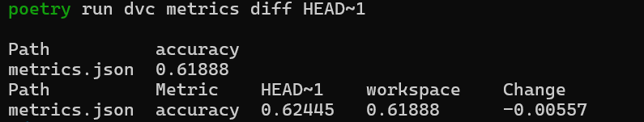

# HW 2

## 1. Overview

The point of HW 2 is setting DVC-based data and model versioning + reproducibility.
Also, from HW 1 we inherit:

- Cookiecutter for the overall template
- Poetry for dependencies, convenient setup with pyproject
- Pre-commit hooks and linting (Black, isort, Ruff, MyPy, Bandit)
- `wine_predictor` as a package
- Jupyter notebook solution using that package
- Docker reproducibility
- Git usage: starting out with pushing changes to `develop` branch, testing docker on `feature/docker`, finally pushing to `main`

#### A few notes on the specifics:
- We use Wine Quality prediction as an example
- The actual ML pipeline is just a baseline solution, for now we don't really care about metrics
- Running the Docker container means running the training and printing the metrics by default
- A few folders from the template (e.g. `data/processed`) were kept even though they are not currently used in case we need them in the future
- We don't actually make and plots or figures, but keep those folders for the reason mentioned above
- Detailed tool configs can be found in the corresponding files (mainly `pyproject.toml`)
- Why DVC? Seemed versatile and simple enough. I like the parallels between DVC and Git.


## 2. Project Structure


## 3. Dependency Management

### 3.1 Poetry

Poetry is used as the dependency manager

This is a barebones example of using poetry to install our dependencies:

```bash
pip install --user poetry

poetry config virtualenvs.in-project true

poetry install
```

This creates `.venv/` inside the project and installs everything from `pyproject.toml` / `poetry.lock`.

### 3.2 pyproject.toml

It contains:
* Project metadata
* Python dependencies
* Dev dependencies (linters, pre-commit hooks, jupyter)
* Tool configuration

Installing from scratch:

```bash
git clone https://github.com/RageAgainstTheAssembly/EPML-ITMO
cd EPML_ITMO
poetry install
```

---

## 4. Formatters, Linters, Pre-commit hooks


* Black – code formatter
* isort – import sorter
* Ruff – fast linter + auto-fixes
* MyPy – static type checker
* Bandit – security scanner


Installing and running hooks:

```bash
poetry run pre-commit install

poetry run pre-commit run --all-files
```


## 5. Actual ML Solution

### 5.1 Implementation
Won't be going into detail - it's essentially a basic SKLearn pipeline with a Logistic Regression classifier. Training a great ML model is not the point of this homework

### 5.3 Running from a notebook

Solution in `notebooks/solution.ipynb` uses the package code to run training and inference.


## 6. Jupyter Setup

We use Jupyter to showcase usage and register a dedicated kernel:

```bash
poetry add --group dev jupyterlab ipykernel

poetry run python -m ipykernel install --user --name epml-wine --display-name "Python (epml_itmo)"

poetry run jupyter lab
```

## 7. Docker


We provide a simple `Dockerfile` in the project root

To build and run:

```bash
docker build -t epml-wine:dev .

docker run --rm epml-wine:dev
```
This should train the model and print its metrics to console.
Note that the docker image works as a demo, we didn't change it to use DVC itself.


## 8. Versioning tools
DVC was chosen because it's very versatile and also more distinct than Git LFS, which I already have some experience with.
We use DVC for both data and model versioning, while also tracking hyperparams and metrics.

## 9. Data versioning
We use a local remote to keep track of our only dataset - WineQT.csv

## 10. Model versioning and hyperparams
Model and training hyperparams are contained in params.yaml.
Example:
```yaml
model:
  max_iter: 1000
  C: 1.0
  multi_class: auto
  random_state: 42
  test_size: 0.2
```
The core training script `wine_predictor/modeling/train.py` loads these params, trains the model accordingly and saves the artifacts for DVC:

1. models/baseline_logreg.joblib – trained model

2. metrics.json – evaluation metrics

We define a `train` stage in `dvc.yaml`:
```bash
poetry run dvc stage add -f -n train \
  -d data/external/WineQT.csv \
  -d wine_predictor/dataset.py \
  -d wine_predictor/features.py \
  -d wine_predictor/modeling/train.py \
  -p model \
  -o models/baseline_logreg.joblib \
  -M metrics.json \
  poetry run python -m wine_predictor.modeling.train
```

## 11. Reproducing experiments and tracking metrics
To inspect and compare metrics:
```bash
poetry run dvc metrics show
poetry run dvc metrics diff HEAD~1
```



## 12. Reproducing everything


```bash
# 1. Clone
git clone https://github.com/RageAgainstTheAssembly/EPML-ITMO
cd EPML_ITMO

# 2. Poetry
pip install --user poetry
poetry config virtualenvs.in-project true

# 3. Dependencies
poetry install

# 4. Install pre-commit hooks and run them
poetry run pre-commit install
poetry run pre-commit run --all-files

# 5. Get data and model artifacts from DVC remote (this assumes you have access to the remote)
poetry run dvc pull

# 6. Reproduce the training pipeline from DVC
poetry run dvc repro

# 7. Compare versions
poetry run dvc metrics show
poetry run dvc metrics diff

# 8. (Optional) Start JupyterLab
poetry run jupyter lab

# 9. (Optional) Docker
docker build -t epml-wine:dev .
docker run --rm epml-wine:dev
```
